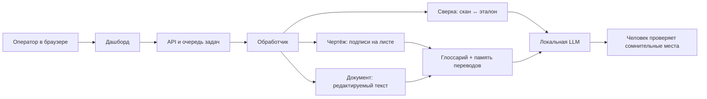

# DocCore
Enterprise IDP-платформа для технической документации на инфраструктуре заказчика.

Перевод чертежей, сверка сканов с эталоном и перевод документов — в одном контуре. Без облака, без утечек, без «чёрного ящика»: данные остаются у вас, термины — под вашим контролем, результат — прозрачен для специалиста.

Оператор открывает браузер, загружает файл и получает готовый результат. Не часы ручной работы — минуты в очереди задач.

---

## Зачем это предприятию

Техническая документация — узкое место: экспорт, локализация, сверка паспортов, разнобой терминов, ошибки при ручном вводе. DocCore закрывает этот контур end-to-end:

| Было | Стало |
|------|--------|
| Ручной перевод подписей на чертежах | Автолокализация с глоссарием предприятия |
| Сверка «на глаз» по скану | Поле за полем: `MATCH` / `MISMATCH` + отчёт |
| Разные переводы одного термина | Единый язык через Glossary + Translation Memory |
| Документы во внешнем SaaS | Полностью локальный контур под требования ИБ |
| Непонятно, где ошиблась модель | Подсветка сомнительных мест для человека |

---

## Почему DocCore

- **On-prem / air-gapped** — данные не уходят во внешние сервисы
- **Термины под контролем** — не свободный перевод модели, а словарь предприятия
- **Доверие к сверке** — OCR + vision, проверка что значение реально есть на скане
- **Человек в контуре** — ИИ ускоряет, специалист утверждает
- **Готово к потоку** — очередь, дашборд, интеграция в существующие процессы
- **Один продукт — три сценария** — чертежи, сверка, документы без зоопарка инструментов

---

## Возможности

- **Перевод чертежей** — локализация подписей RU ↔ EN (PDF, DXF, изображения)
- **Сверка документов** — скан ↔ эталон → вердикт по полям и отчёт для процессов качества
- **Перевод документов** — связный текст RU ↔ EN (TXT, DOCX, PDF)
- **Глоссарий и TM** — единый язык предприятия в каждом результате
- **Vision-LLM** — рукопись и защита от ложных совпадений на «пустых» зонах скана
- **Оценка качества** — фокус проверки на сомнительных фрагментах, а не на всём тексте подряд

---

## Как устроена платформа

Один контур на инфраструктуре заказчика. Оператор работает в браузере: загрузил файл — задача встала в очередь — получил результат. Модель переводит, словарь предприятия фиксирует термины, человек проверяет сомнительные места.

| Режим | Вход | Результат |
|-------|------|-----------|
| Чертёж | PDF, DXF, изображение | Лист с переводом подписей на месте |
| Документ | TXT, DOCX, PDF | Редактируемый перевод |
| Сверка | Скан + эталон | `MATCH` / `MISMATCH` по полям и отчёт |

Три режима — разные движки в одном продукте: чертёж остаётся чертежом, документ остаётся документом. Глоссарий и Translation Memory общие: утверждённый термин не «плывёт» от файла к файлу. Если языковая модель недоступна, контур продолжает работу по словарю и правилам — без отправки данных во внешние сервисы.

---

## Для кого

Крупные предприятия с потоком конструкторской и сопроводительной документации — там, где важны локальный контур, предсказуемое качество перевода и сверки, и масштабирование без зависимости от внешних SaaS.

---

## Стек

FastAPI · очередь задач · OCR/CAD · веб-дашборд · LLM (текст + зрение)

---

## Лицензия

Proprietary. Все права защищены.
